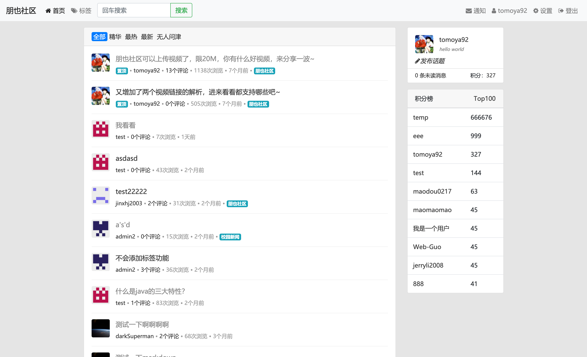
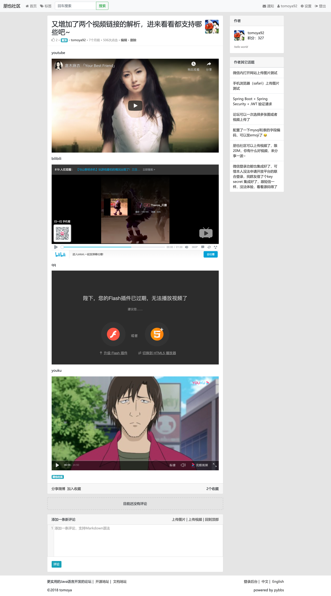

# PyBBS — Java BBS Forum System / Java 论坛系统

> **Note / 注意：** Please mark "powered by pybbs" in a conspicuous place when using this project.  
> 使用本项目时，请在醒目位置标明 **powered by pybbs**。

**Current Version / 当前版本：** `5.2.1`

**[中文](#中文) | [English](#english)**

---

## English

### Overview

PyBBS is a practical BBS (Bulletin Board System) forum built with Java. It provides a full-featured community platform with a front-end for users, an admin panel for management, and a REST API. The system supports rich content editing, tag-based topic organization, a user score/reputation system, real-time notifications via WebSocket, multi-language (I18N) support, and a plugin architecture for extensibility.

### Access

| Page | URL | Credentials |
|------|-----|-------------|
| Forum | `http://localhost:8080/` | Register yourself |
| Admin Panel | `http://localhost:8080/adminlogin` | `admin` / `123123` |

### Tech Stack

| Category | Technology |
|----------|-----------|
| Framework | Spring Boot 2.2.2 + Undertow |
| ORM | MyBatis-Plus 3.0.7 |
| Auth | Apache Shiro |
| Template | Freemarker |
| Database | MySQL 5.7 |
| Cache | Redis (Jedis) |
| Search | Elasticsearch 6.5.3 |
| Real-time | WebSocket |
| DB Migration | Flyway |
| Markdown | CommonMark |
| OAuth | JustAuth |
| i18n | Spring I18N |

### Features

- **Topic Management** — Create, edit, pin, feature (mark as "good"), and delete topics with Markdown support (CodeMirror editor)
- **Comment System** — Nested/layered comments, up-voting, logical deletion
- **Tag System** — Attach multiple tags to topics; topic count tracking per tag
- **User System** — Registration, login, avatar upload, profile editing, token-based authentication
- **Score System** — Points awarded/deducted for creating topics, commenting, and receiving likes; configurable via admin panel
- **OAuth Login** — Third-party login via GitHub (extensible via JustAuth)
- **SMS Login** — Alibaba Cloud SMS verification code login
- **Notification System** — In-app notifications with WebSocket real-time push (optional)
- **Sensitive Word Filter** — Configurable word list managed from admin panel
- **Elasticsearch Search** — Optional full-text search (toggled in system config)
- **Email Notifications** — SMTP email alerts for mentions and replies
- **Telegram Bot** — Optional Telegram bot integration
- **Cloud Storage** — Supports Alibaba Cloud OSS, Qiniu Cloud, Backblaze B2, and AWS S3
- **RBAC Permissions** — Role-based access control for the admin panel (super-admin, reviewer roles)
- **I18N** — Chinese (zh_CN) and English (en_US) built in
- **Plugin Architecture** — Spring AOP-based plugin system; zero intrusion into core code
- **Theme Support** — Pluggable theme system; `default` theme built in
- **Docker Support** — Ready-to-use `Dockerfile` and `docker-compose.yml`

### Project Structure

```
pybbs/
├── src/main/java/co/yiiu/pybbs/
│   ├── config/          # Spring, Shiro, WebSocket, DataSource configs
│   ├── controller/
│   │   ├── admin/       # Admin panel controllers
│   │   ├── api/         # REST API controllers
│   │   └── front/       # Front-end page controllers
│   ├── service/         # Business logic (topic, comment, user, tag …)
│   ├── directive/       # Freemarker custom directives
│   ├── plugin/          # Plugin integration (Redis, etc.)
│   └── util/            # Utilities (MD5, Markdown, Captcha, IP …)
├── src/main/resources/
│   ├── templates/       # Freemarker templates (theme/default)
│   ├── static/          # CSS, JS, images
│   ├── db/migration/    # Flyway SQL migrations (V1 → V1.20)
│   └── i18n/            # Message bundles (zh_CN, en_US)
├── plugins/             # Optional AOP plugins & theme plugins
├── docs/                # Project documentation (AsciiDoc / Maven Site)
├── Dockerfile
├── docker-compose.yml
└── pom.xml
```

### Database Schema (Core Tables)

| Table | Description |
|-------|-------------|
| `user` | Forum users; stores token, score, avatar, email |
| `topic` | Forum topics; supports pin, feature, view count, up-votes |
| `comment` | Comments on topics; supports nesting and logical deletion |
| `tag` | Topic tags |
| `topic_tag` | Many-to-many: topics ↔ tags |
| `collect` | User topic collections/bookmarks |
| `notification` | Read/unread notifications |
| `admin_user` | Admin panel users |
| `role` / `permission` | RBAC roles and permissions |
| `system_config` | All site settings (stored in DB, editable from admin) |
| `oauth_user` | Third-party OAuth accounts |

### Quick Start

#### 1. Prerequisites

- JDK 8+
- Maven 3.x
- MySQL 5.7+
- (Optional) Redis, Elasticsearch 6.x

#### 2. Configure Database

Create `src/main/resources/application-dev.yml`:

```yaml
site:
  datasource_url: jdbc:mysql://localhost:3306/pybbs?useSSL=false&characterEncoding=utf8&serverTimezone=Asia/Shanghai
  datasource_username: root
  datasource_password: yourpassword
```

Flyway will automatically run all SQL migrations under `db/migration/` on startup.

#### 3. Build & Run

```bash
mvn clean package
java -jar target/pybbs.jar
```

#### 4. Run with Plugins

```bash
java -Dloader.path=./plugins -jar pybbs.jar
```

#### 5. Docker Compose

```bash
docker-compose up -d
```

### Plugin Development

Plugins use Spring AOP to intercept service methods — zero modification to core code required.

**Naming conventions:**
- Plugin name must end with `-plugin` (e.g. `redis-cache-plugin`)
- Theme plugins must start with `theme-` (e.g. `theme-simple-plugin`)
- Plugin package must be `co.yiiu.pybbs.plugin`
- Must compile with JDK 8

**Available plugins:**
- `comment-layer-plugin` — Nested/layered comment sorting
- `redis-cache-plugin` — Redis cache for common queries
- `theme-simple-plugin` — Simple alternative theme

### System Configuration (Admin Panel)

All settings are managed from the admin panel without touching config files:

| Category | Settings |
|----------|---------|
| Basic | Site name, intro, URL, page size, theme, cookie settings |
| Email | SMTP host, username, password |
| Upload | Upload path, static URL, avatar size limit, cloud storage |
| Score | Points for creating/deleting topics & comments, up-voting |
| Redis | Host, port, password, database, timeout |
| Elasticsearch | Host, port, index name, enable search |
| OAuth (GitHub) | Client ID, Client Secret, callback URL |
| WebSocket | Enable/disable, host, port |

### License

**GNU AGPLv3** — Free for personal learning. Commercial use requires a one-time license fee of ¥68.00.

### Feedback & Contribution

- Issues: [GitHub Issues](https://github.com/atjiu/pybbs/issues)
- PR welcome!

---

## 中文

### 项目简介

PyBBS 是一款用 Java 开发的实用 BBS 论坛系统。它提供完整的社区功能平台，包括：面向用户的前台、面向管理员的后台以及 REST API 接口。系统支持富文本/Markdown 内容编辑、基于标签的话题分类、用户积分/声望体系、基于 WebSocket 的实时通知、多语言（I18N）支持，以及面向可扩展性的插件架构。

### 访问地址

| 页面 | 地址 | 账号密码 |
|------|------|---------|
| 论坛前台 | `http://localhost:8080/` | 自行注册 |
| 管理后台 | `http://localhost:8080/adminlogin` | `admin` / `123123` |

### 技术栈

| 分类 | 技术 |
|------|------|
| 框架 | Spring Boot 2.2.2 + Undertow |
| ORM | MyBatis-Plus 3.0.7 |
| 权限认证 | Apache Shiro |
| 模板引擎 | Freemarker |
| 数据库 | MySQL 5.7 |
| 缓存 | Redis（Jedis） |
| 搜索 | Elasticsearch 6.5.3 |
| 实时通信 | WebSocket |
| 数据库迁移 | Flyway |
| Markdown | CommonMark |
| 第三方登录 | JustAuth |
| 国际化 | Spring I18N |

### 功能特性

- **话题管理** — 创建、编辑、置顶、加精、删除话题，支持 Markdown（CodeMirror 编辑器）
- **评论系统** — 盖楼式嵌套评论、点赞、逻辑删除
- **标签系统** — 话题多标签、标签话题数统计
- **用户系统** — 注册、登录、头像上传、资料编辑、Token 认证
- **积分体系** — 发帖、评论、被点赞均可奖励积分，删除则扣除，后台可配置
- **第三方登录** — 支持 GitHub 登录（通过 JustAuth 可扩展更多平台）
- **短信登录** — 阿里云短信验证码登录
- **通知系统** — 站内通知，可开启 WebSocket 实时推送（无需刷新页面）
- **敏感词过滤** — 管理后台配置敏感词词库
- **全文搜索** — 可选 Elasticsearch 全文搜索（系统配置中开关）
- **邮件通知** — SMTP 邮件提醒（被@、被回复时）
- **Telegram Bot** — 可选 Telegram 机器人集成
- **云存储** — 支持阿里云 OSS、七牛云、Backblaze B2、AWS S3
- **RBAC 权限** — 后台角色权限控制（超级管理员、审核员等）
- **国际化** — 内置中文（zh_CN）与英文（en_US）
- **插件架构** — 基于 Spring AOP 的插件系统，零侵入核心代码
- **主题支持** — 可插拔主题系统，内置 `default` 主题
- **Docker 支持** — 提供 `Dockerfile` 和 `docker-compose.yml`

### 项目结构

```
pybbs/
├── src/main/java/co/yiiu/pybbs/
│   ├── config/          # Spring、Shiro、WebSocket、数据源等配置
│   ├── controller/
│   │   ├── admin/       # 后台管理控制器
│   │   ├── api/         # REST API 控制器
│   │   └── front/       # 前台页面控制器
│   ├── service/         # 业务逻辑（话题、评论、用户、标签……）
│   ├── directive/       # Freemarker 自定义指令
│   ├── plugin/          # 插件集成（Redis 等）
│   └── util/            # 工具类（MD5、Markdown、验证码、IP……）
├── src/main/resources/
│   ├── templates/       # Freemarker 模板（theme/default）
│   ├── static/          # CSS、JS、图片等静态资源
│   ├── db/migration/    # Flyway SQL 迁移脚本（V1 → V1.20）
│   └── i18n/            # 国际化消息文件（zh_CN、en_US）
├── plugins/             # 可选 AOP 插件 & 主题插件
├── docs/                # 项目文档（AsciiDoc / Maven Site）
├── Dockerfile
├── docker-compose.yml
└── pom.xml
```

### 数据库核心表

| 表名 | 说明 |
|------|------|
| `user` | 论坛用户；存储 token、积分、头像、邮箱 |
| `topic` | 论坛话题；支持置顶、加精、浏览量、点赞 |
| `comment` | 话题评论；支持嵌套盖楼与逻辑删除 |
| `tag` | 话题标签 |
| `topic_tag` | 话题与标签的多对多关联 |
| `collect` | 用户收藏的话题 |
| `notification` | 站内通知（已读/未读） |
| `admin_user` | 后台管理员账号 |
| `role` / `permission` | RBAC 角色与权限 |
| `system_config` | 所有站点配置（存库，后台可编辑） |
| `oauth_user` | 第三方 OAuth 绑定账号 |

### 快速开始

#### 1. 环境要求

- JDK 8+
- Maven 3.x
- MySQL 5.7+
- （可选）Redis、Elasticsearch 6.x

#### 2. 配置数据库

创建 `src/main/resources/application-dev.yml`：

```yaml
site:
  datasource_url: jdbc:mysql://localhost:3306/pybbs?useSSL=false&characterEncoding=utf8&serverTimezone=Asia/Shanghai
  datasource_username: root
  datasource_password: 你的密码
```

启动时 Flyway 会自动执行 `db/migration/` 下的所有迁移脚本，无需手动建表。

#### 3. 编译运行

```bash
mvn clean package
java -jar target/pybbs.jar
```

#### 4. 带插件启动

```bash
java -Dloader.path=./plugins -jar pybbs.jar
```

#### 5. Docker Compose 启动

```bash
docker-compose up -d
```

### 插件开发

插件通过 Spring AOP 切面拦截 Service 方法实现，无需修改核心代码。

**命名规范：**
- 插件名必须以 `-plugin` 结尾，如 `redis-cache-plugin`
- 主题插件以 `theme-` 开头，以 `-plugin` 结尾，如 `theme-simple-plugin`
- 插件包名必须为 `co.yiiu.pybbs.plugin`
- 必须使用 JDK 8 编译

**内置插件：**
- `comment-layer-plugin` — 评论盖楼排序
- `redis-cache-plugin` — 常用查询 Redis 缓存
- `theme-simple-plugin` — 简洁风格主题

### 系统配置（后台管理）

所有配置均可在后台管理界面修改，无需改动配置文件：

| 分类 | 配置项 |
|------|-------|
| 基础配置 | 站点名称、简介、访问域名、分页数量、主题、Cookie 设置 |
| 邮箱配置 | SMTP 地址、用户名、密码 |
| 上传配置 | 上传路径、静态文件访问地址、头像大小限制、云存储 |
| 积分配置 | 发帖/删帖/评论/删评/点赞积分规则 |
| Redis 配置 | Host、端口、密码、数据库编号、超时时间 |
| Elasticsearch 配置 | Host、端口、索引名、是否开启搜索 |
| GitHub 登录配置 | Client ID、Client Secret、回调地址 |
| WebSocket 配置 | 是否开启、Host、端口 |

### 开源协议

**GNU AGPLv3** — 个人学习使用永久免费；商用授权一次性付费 **¥68.00** 永久使用。

### 反馈与贡献

- 提交 Issue：[GitHub Issues](https://github.com/atjiu/pybbs/issues)
- 欢迎提交 PR！

---

### 截图 / Screenshots

**首页列表 / Home**



**帖子详情 / Topic Detail**


**视频解析 / Video Parsing**


